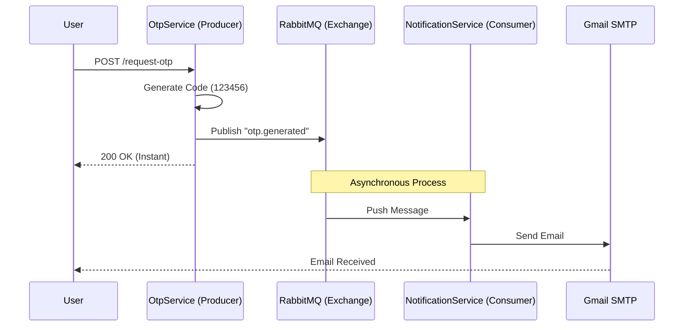

# Tutorial: Implementing Asynchronous Microservices Communication with RabbitMQ

- **Project:** Secure HR Payroll System
- **Topic:** Message Brokers & Event-Driven Architecture

### 1. Introduction in modern distributed software architecture:

The way services communicate is just as important as the services themselves. A common pitfall in microservices is tight coupling, where Service A calls Service B synchronously (HTTP/REST) and waits for a response.

In my **Secure HR Payroll System**, I face a critical user experience challenge: **One-Time Password (OTP) Delivery**.

### The Problem: Synchronous Blocking

When a user requests to change their IBAN, the system must generate a secure code and send it via email. If we implement this synchronously:

1. User clicks "Get Code".
2. Server generates code.
3. Server connects to Gmail SMTP (external).
4. Server waits 2-5 seconds for Gmail to confirm delivery.
5. Server finally responds to User.

If the email provider is slow or down, the user interface freezes or crashes. This is unacceptable for a high-availability enterprise system.

### The Solution: Asynchronous Messaging

I solve this by introducing a **Message Broker (RabbitMQ)**.

1. **Producer (API):** Generates code, drops a message in the queue, and responds immediately (< 50ms).
2. **Broker:** Safely stores the message.
3. **Consumer (Worker):** Pick up the message in the background and handles the email sending.

This tutorial guides you through implementing this pattern using **.NET 8** and **RabbitMQ**.

---

## 2. System ArchitectureWe utilize the **Publisher/Subscriber** pattern (specifically using a Direct Exchange).

### Component Overview

- **HrPayroll.OtpService (Producer):** The REST API that receives the user's HTTP request.

- **RabbitMQ (Broker):** The intermediary running in a Docker container.
- **HrPayroll.Notifications (Consumer):** A .NET Worker Service that listens for messages and sends emails via SMTP.

### Workflow Diagram



---

## 3. Infrastructure Setup (Docker)

Before writing code, we need a running Message Broker. I use **Docker Compose** to define RabbitMQ as a service. This ensures our development environment is consistent and isolated.

**File:** `docker-compose.yml`

```yaml
services:
  rabbitmq:
    image: rabbitmq:3-management
    container_name: mfa-rabbitmq
    ports:
      - "5672:5672" # AMQP Protocol port (used by my app)
      - "15672:15672" # Management Dashboard (used by me)
    environment:
      RABBITMQ_DEFAULT_USER: guest
      RABBITMQ_DEFAULT_PASS: guest
    networks:
      - mfa-network
```

**Key Takeaway:** I expose port `15672` so I can visually debug my queues at `http://localhost:15672`.

---

## 4. Implementation: The Producer

The Producer is located in the `HrPayroll.OtpService`. Its job is to serialize the event data and push it to the exchange.

**Library Used:** `RabbitMQ.Client` (Version 7.0.0)

### The Publisher Service

I implemented a `RabbitMqProducer` class. A critical detail here is **Lazy Initialization**. Since RabbitMQ.Client v7 is fully asynchronous, we cannot open connections in the constructor. We establish the connection only when the first message needs to be sent.

**Code Snippet:** `RabbitMqProducer.cs`

```csharp
public async Task SendMessageAsync<T>(T message, string routingKey)
{
    // 1. Ensure Connection is Open
    await EnsureConnectionAsync();

    // 2. Serialize Data
    var json = JsonSerializer.Serialize(message);
    var body = Encoding.UTF8.GetBytes(json);

    // 3. Publish to "otp_exchange"
    var props = new BasicProperties();
    await _channel!.BasicPublishAsync(
        exchange: "otp_exchange",
        routingKey: routingKey, // e.g., "otp.generated"
        mandatory: false,
        basicProperties: props,
        body: body
    );
}

```

### The Controller Logic

In the API Controller, I inject this producer. Notice how the controller does not know _how_ the email is sent, or even _if_ it is sent. It only cares that the message was handed off.

```csharp
// Inside OtpController.cs
[HttpPost("request")]
public async Task<IActionResult> RequestOtp([FromBody] OtpRequestDto request)
{
    // ... validation logic ...

    // Publish Event (Fire and Forget)
    await _messageProducer.SendMessageAsync(new { Email = userEmail, Code = generatedOtp }, "otp.generated");

    return Ok(new { message = "OTP requested successfully." });
}

```

---

## 5. Implementation: The Consumer

The Consumer is located in `HrPayroll.Notifications`. This is a Background Worker that runs continuously.

### Configuration

To handle the RabbitMQ connection robustly, especially on macOS where `localhost` can be ambiguous (IPv4 vs IPv6), I explicitly configure the endpoint.

**File:** `appsettings.json`

```json
"RabbitMQ": {
  "HostName": "127.0.0.1",
  "UserName": "guest",
  "Password": "guest"
}

```

### The Worker Logic

The worker performs three key steps on startup:

1. **Declare Exchange:** Ensures the "post office" exists.
2. **Declare Queue:** Ensures the "mailbox" (`notification_email_queue`) exists.
3. **Bind:** Connects the mailbox to the post office using a specific address (`otp.generated`).

**Code Snippet:** `Worker.cs`

```csharp
// 1. Setup Consumer
var consumer = new AsyncEventingBasicConsumer(_channel);

consumer.ReceivedAsync += async (model, ea) =>
{
    var body = ea.Body.ToArray();
    var messageJson = Encoding.UTF8.GetString(body);

    // 2. Deserialize & Process
    var data = JsonDocument.Parse(messageJson);
    var email = data.RootElement.GetProperty("Email").GetString();
    var code = data.RootElement.GetProperty("Code").GetString();

    // 3. Perform the Heavy Lifting (SMTP)
    await SendEmailAsync(email, code);
};

// 4. Start Listening
await _channel.BasicConsumeAsync(queue: "notification_email_queue", autoAck: true, consumer: consumer);

```

This worker uses **MailKit** to connect to Gmail's SMTP servers securely, ensuring real-world delivery of the notification.

---

## 6. Verification and Testing

To verify the implementation, I performed an end-to-end integration test.

### Step 1: Start Infrastructure

I started the container stack using Docker Compose:

```bash
docker-compose up -d

```

### Step 2: Trigger the Event

I used Swagger UI to send a POST request to the API.

- **Endpoint:** `POST /api/otp/request`
- **Latency Observed:** 45ms (Extremely fast because it didn't wait for email).

### Step 3: Verify Delivery

I checked the logs of the Notification Service.

**Log Output:**

```text
info: HrPayroll.Notifications.Worker[0]
      Connected to RabbitMQ. Waiting for messages...
info: HrPayroll.Notifications.Worker[0]
      Email sent to student@university.edu via Gmail!

```

This confirms the message traveled through the broker, was picked up by the worker, and the email was successfully dispatched via Gmail SMTP.

---

## 8. Conclusion

By implementing RabbitMQ, the **Secure HR Payroll System** achieved:

1. **Performance:** API response time is fast.
2. **Reliability:** Temporary email server failures no longer crash the application.
3. **Maintainability:** The OTP logic is strictly separated from the Email Logic.

This architecture serves as a robust foundation for adding future notification channels (like SMS) without modifying the core OTP service.
